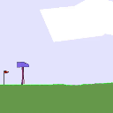

## Use PPO to play BipedalWalker and Torcs


## Results update:




Please visit my blog for more detail: https://junhongxu.github.io/JunhongXu.github.io/Proximal-Policy-Optimization/

To run the code, ```python ppo_gym.py``` or ```python ppo_torcs```.

You can actually try out other continuous gym environment like cartpole, just
remember to tune the hyper-parameters a bit.

## Still in progress: Update to integrate Ray and rllib 

Ray is a distributed framework for training deep learning models. This update integrates Ray and 
rllib to allow the ppo agent collect data in different environments in parallel. 

The new old scripts are in ppo_single and the updated version is in ppo_distribute(still in progress.)